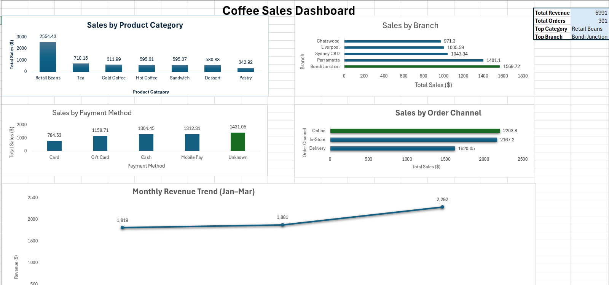

# Coffee Sales Excel Dashboard
This project analyzes coffee shop sales data using Microsoft Excel and presents insights through an interactive dashboard.

## Dashboard Preview

## Tools Used
- Microsoft Excel
- Pivot Tables
- Charts & Data Visualization

## Dashboard Features
- Sales by Product Category
- Sales by Branch
- Sales by Payment Method
- Sales by Order Channel
- Monthly Revenue Trend
- KPI Metrics:
  - Total Revenue
  - Total Orders
  - Top Category
  - Top Branch

## Key Insights
- Revenue shows a consistent upward trend from January to March, indicating business growth.
- Retail Beans is the highest-performing product category, contributing the largest share of total revenue.
- Bondi Junction is the top-performing branch, significantly outperforming other locations.
- Online orders generate the highest revenue, highlighting the importance of digital sales channels.
- Cash and mobile payments are the most preferred payment methods among customers.

## Files Included
- coffee-sales-excel-dashboard.xlsx
- Dashboard screenshots

## Project Purpose
This project was created to practice and demonstrate end-to-end data analysis skills, including data cleaning, transformation, and visualization using Microsoft Excel. It showcases the ability to extract business insights from raw sales data and present them through an interactive dashboard, aligned with real-world data analyst responsibilities.
